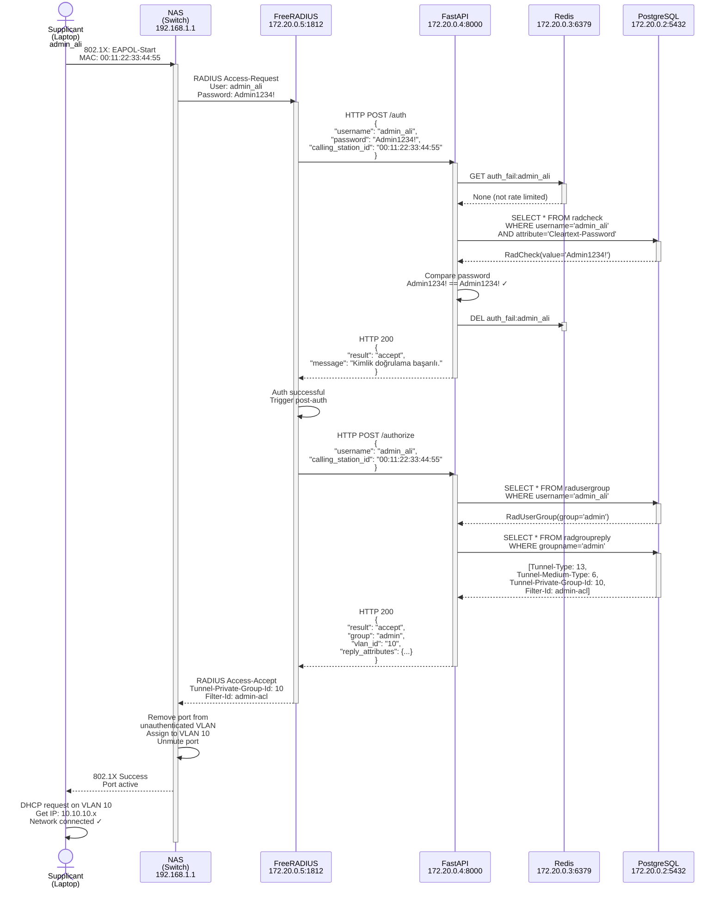
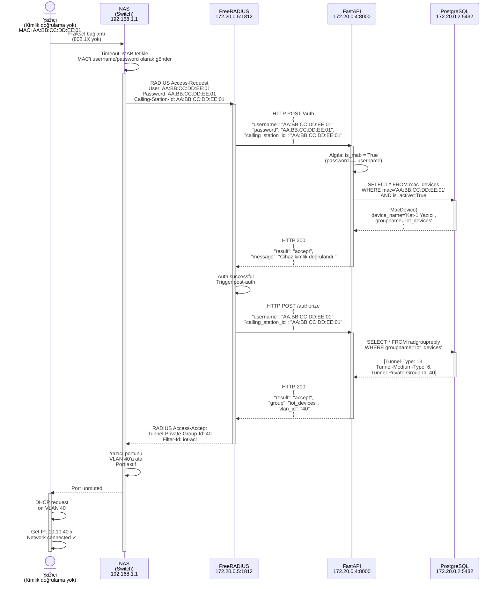
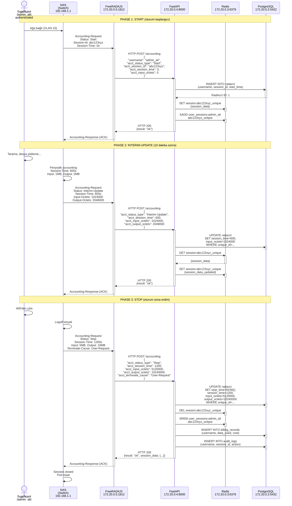

# Uçtan Uca İstek Akışı (End-to-End Request Flows)

Bu dokument NAC sistemindeki üç temel kimlik doğrulama ve muhasebe senaryosunun detaylı adım adım akışlarını ve Mermaid diyagramlarını içerir.

---

## Senaryo 1: PAP Kimlik Doğrulama (Username + Password)

**Aktörler:**
- Supplicant (laptop, 802.1X credentials)
- NAS (switch, 192.168.1.1)
- FreeRADIUS (172.20.0.5:1812)
- FastAPI (172.20.0.4:8000)
- PostgreSQL (172.20.0.2:5432)
- Redis (172.20.0.3:6379)

**Başlangıç:** Kullanıcı "admin_ali" / "Admin1234!" ile giriş yapmaya çalışıyor

### Adım Adım Akış

#### T0: Supplicant → NAS (802.1X Başlangıcı)

```
Kullanıcı hareketi: WiFi aç, SSID seç, kimlik bilgilerini gir
NAS (switch): Kimlik doğrulama yapılmamış trafiği bloke et, 802.1X tetikle

Paket:
├─ EAPOL-Start frame
├─ Supplicant MAC adresi: 00:11:22:33:44:55
└─ Şifre: Admin1234!
```

#### T1: NAS → FreeRADIUS (RADIUS Access-Request)

```
Kaynak: NAS (192.168.1.1)
Hedef: FreeRADIUS 172.20.0.5:1812/UDP
Paylaşılan Gizli: "testing123" (clients.conf dosyasından)

Paket Özellikleri:
├─ User-Name: admin_ali
├─ User-Password: Admin1234! (paylaşılan gizli ile karıştırılmış)
├─ NAS-IP-Address: 192.168.1.1
├─ NAS-Port-Id: 1
├─ Called-Station-Id: <switch-SSID>
├─ Calling-Station-Id: 00:11:22:33:44:55
└─ Service-Type: Framed-User
```

#### T2: FreeRADIUS authorize → FastAPI /auth

```
FreeRADIUS Access-Request alır
  → routes/default: authorize bölümü
  → rlm_rest modülü etkinleşir
  → http://nac-api:8000/auth adresine HTTP POST

JSON İstek Gövdesi:
{
  "username": "admin_ali",
  "password": "Admin1234!",
  "calling_station_id": "00:11:22:33:44:55"
}
```

#### T3: FastAPI /auth uç noktası (routes/auth.py:authenticate)

```
1. RadiusAuthRequest alır
2. is_mab kontrolü = calling_station_id ve şifre kontrolü
   → calling_station_id = "00:11:22:33:44:55" (kullanıcı tarafından verilen)
   → password = "Admin1234!" (kullanıcı tarafından verilen)
   → "Admin1234!" != "00:11:22:33:44:55" → False (PAP modu)

3. _handle_pap(username="admin_ali", password="Admin1234!") çağrı

_handle_pap içinde:
  a) Hız sınırlaması kontrolü (auth_fail:admin_ali anahtarı Redis'te)
     → redis_client.get("auth_fail:admin_ali") → None (önceki denemeler yok)
     → Sınırlanmamış, devam et

  b) PostgreSQL sorgusu: SELECT * FROM radcheck
     WHERE username='admin_ali' AND attribute='Cleartext-Password'
     → db.execute(stmt)
     → Döner: RadCheck(id=1, username='admin_ali',
       attribute='Cleartext-Password', value='Admin1234!')

  c) Şifre karşılaştırması:
     user_record.value ('Admin1234!') == password ('Admin1234!')
     → Eşleşme! ✓

  d) Hız sınırlaması sayacını sıfırla:
     redis_client.delete("auth_fail:admin_ali")

  e) AuthResponse döndür(result="accept", message="...")
```

#### T4: FreeRADIUS ← FastAPI (HTTP 200 + JSON Yanıt)

```
HTTP 200 OK

Yanıt JSON:
{
  "result": "accept",
  "reply_attributes": {},
  "message": "Kimlik doğrulama başarılı."
}
```

#### T5: FreeRADIUS post-auth → FastAPI /authorize

```
FreeRADIUS HTTP 200 alır
  → Auth başarılı
  → post-auth bölümü tetikle (rlm_rest modülü)
  → http://nac-api:8000/authorize adresine HTTP POST

JSON İstek:
{
  "username": "admin_ali",
  "calling_station_id": "00:11:22:33:44:55"
}
```

#### T6: FastAPI /authorize uç noktası (routes/authorize.py)

```
1. RadiusAuthorizeRequest alır
2. calling_station_id kontrol: "00:11:22:33:44:55" → Cihaz kimlik doğrulama deği
3. Normale dönüş: kullanıcı yolu
4. radusergroup sorgusu:
   SELECT * FROM radusergroup WHERE username='admin_ali'
   → Döner: RadUserGroup(username='admin_ali', groupname='admin', priority=1)
5. _build_authorize_response(group='admin', db) çağrı
6. radgroupreply sorgusu:
   SELECT * FROM radgroupreply WHERE groupname='admin'
   → Döner 4 satır:
      - Tunnel-Type: 13 (VLAN tüneli)
      - Tunnel-Medium-Type: 6 (IEEE 802)
      - Tunnel-Private-Group-Id: 10 (VLAN ID)
      - Filter-Id: admin-acl
7. AuthorizeResponse döndür:
{
  "result": "accept",
  "group": "admin",
  "vlan_id": "10",
  "reply_attributes": {
    "Tunnel-Type": "13",
    "Tunnel-Medium-Type": "6",
    "Tunnel-Private-Group-Id": "10",
    "Filter-Id": "admin-acl"
  }
}
```

#### T7: FreeRADIUS ← FastAPI (HTTP 200 + authorize yanıtı)

```
FreeRADIUS güncelleme:
  → Auth-Type: Accept
  → Reply-Message: /authorize uç noktasından
  → Tunnel-Private-Group-Id: 10 ← kritik VLAN ataması
  → Filter-Id: admin-acl
```

#### T8: FreeRADIUS → NAS (RADIUS Access-Accept)

```
Kaynak: FreeRADIUS 172.20.0.5:1812
Hedef: NAS 192.168.1.1:1812/UDP
Paylaşılan Gizli: "testing123"

Paket Özellikleri:
├─ Sonuç: Access-Accept
├─ Tunnel-Type: 13
├─ Tunnel-Medium-Type: 6
├─ Tunnel-Private-Group-Id: 10  ← VLAN ataması!
├─ Filter-Id: admin-acl
└─ Reply-Message: Başarılı
```

#### T9: NAS → Supplicant (802.1X Başarısı)

```
NAS kimlik doğrulamayı kabul et
  → Portu "kimlik doğrulama yapılmamış" VLAN'dan kaldır
  → Portu VLAN 10'a (admin VLAN) ekle
  → Bu porttaki trafiği aç

Supplicant başarı alır:
  → VLAN 10 DHCP'den IP adresi yapılandır
  → Ağa bağlan
  → Artık admin kaynakları erişebilir
```

### Mermaid Diyagramı: PAP Akışı



### Sonuç Durumu (PAP)

```
Supplicant:
├─ MAC: 00:11:22:33:44:55
├─ Username: admin_ali
├─ Status: Authenticated
├─ VLAN: 10 (admin)
├─ IP Address: 10.10.10.100 (from DHCP)
└─ Permissions: admin-acl filters apply

PostgreSQL radacct:
└─ Session akan kaydedilecek (Accounting aşamasında)

Redis:
├─ Oturum başlığı saklanacak
└─ Aktif kullanıcı listesine eklendi
```

---

## Senaryo 2: MAB (MAC Authentication Bypass)

**Aktörler:**
- Yazıcı (IP-less device, MAC: AA:BB:CC:DD:EE:01)
- NAS (switch)
- FreeRADIUS
- FastAPI
- PostgreSQL

**Başlangıç:** Yazıcı (MAC AA:BB:CC:DD:EE:01) ağa bağlanmak istiyor (password yok!)

### Temel Fark: İsim + Şifre Yok, Sadece MAC Adresi

```
PAP: Username + Password
MAB: MAC adresi (username VE password olarak)

Access-Request:
├─ User-Name: AA:BB:CC:DD:EE:01 (MAC)
├─ User-Password: AA:BB:CC:DD:EE:01 (MAC)
└─ Calling-Station-Id: AA:BB:CC:DD:EE:01 (MAC)
```

### Adım Adım Akış

#### T1: NAS → FreeRADIUS (RADIUS Access-Request)

```
MAB tetiklendi (supplicant 802.1X yanıtlamıyor)
NAS yazıcı MAC'ini kullanıcı/şifre olarak gönderir

Kaynak: NAS (192.168.1.1)
Hedef: FreeRADIUS 172.20.0.5:1812/UDP
Paylaşılan Gizli: "testing123"

Paket:
├─ User-Name: AA:BB:CC:DD:EE:01
├─ User-Password: AA:BB:CC:DD:EE:01
├─ Calling-Station-Id: AA:BB:CC:DD:EE:01
├─ NAS-IP-Address: 192.168.1.1
├─ NAS-Port-Id: 5 (yazıcı portu)
└─ Called-Station-Id: <switch-SSID>
```

#### T2: FreeRADIUS → FastAPI /auth

```
FreeRADIUS Access-Request alır
  → routes/default: authorize bölümü
  → rlm_rest modülü tetiklenir
  → http://nac-api:8000/auth POST

JSON İstek Gövdesi:
{
  "username": "AA:BB:CC:DD:EE:01",
  "password": "AA:BB:CC:DD:EE:01",
  "calling_station_id": "AA:BB:CC:DD:EE:01"
}
```

#### T3: FastAPI /auth (_handle_pap kontrolü)

```
1. RadiusAuthRequest alır
2. MAB kontrolü:
   is_mab = (calling_station_id is not None) AND (password == username)
          = ("AA:BB:CC:DD:EE:01" is not None) AND ("AA:BB:CC:DD:EE:01" == "AA:BB:CC:DD:EE:01")
          = True ← MAB algılandı!

3. → _handle_mab(mac="AA:BB:CC:DD:EE:01", db) çağrı
```

#### T4: _handle_mab işlevi

```
1. MAC normalleştir: AA:BB:CC:DD:EE:01 (zaten normalize)
2. Veritabanında MAC cihazı ara:
   PostgreSQL sorgusu:
   SELECT * FROM mac_devices
   WHERE mac_address='AA:BB:CC:DD:EE:01' AND is_active=True

   Döner: MacDevice(
     mac_address='AA:BB:CC:DD:EE:01',
     device_name='Kat-1 Yazıcı',
     device_type='printer',
     groupname='iot_devices',
     is_active=True
   )

3. Cihaz bulundu! → AuthResponse(result="accept", message="Device authenticated") döndür
```

#### T5: FreeRADIUS ← FastAPI (HTTP 200)

```
HTTP 200 OK

Yanıt JSON:
{
  "result": "accept",
  "reply_attributes": {},
  "message": "Cihaz kimlik doğrulandı."
}
```

#### T6: FreeRADIUS post-auth → FastAPI /authorize

```
FreeRADIUS HTTP 200 alır
  → Auth başarılı
  → post-auth bölümü tetikle
  → http://nac-api:8000/authorize POST

JSON İstek:
{
  "username": "AA:BB:CC:DD:EE:01",
  "calling_station_id": "AA:BB:CC:DD:EE:01"
}
```

#### T7: FastAPI /authorize (MAC cihazı yolu)

```
1. RadiusAuthorizeRequest alır
2. calling_station_id kontrolü:
   calling_station_id = "AA:BB:CC:DD:EE:01" (sağlanmış)
   → MAC cihazı yolu
3. mac_address = username = "AA:BB:CC:DD:EE:01"
4. Veritabanında cihaz ara (zaten auth'dan biliniyor):
   SELECT * FROM mac_devices
   WHERE mac_address='AA:BB:CC:DD:EE:01' AND is_active=True
   → Returns: groupname='iot_devices'

5. _build_authorize_response(group="iot_devices", db) çağrı

6. radgroupreply sorgusu:
   SELECT * FROM radgroupreply WHERE groupname='iot_devices'
   → Returns (IoT grubu için):
      - Tunnel-Type: 13
      - Tunnel-Medium-Type: 6
      - Tunnel-Private-Group-Id: 40 (IoT VLAN)
      - Filter-Id: iot-acl

7. AuthorizeResponse döndür:
{
  "result": "accept",
  "group": "iot_devices",
  "vlan_id": "40",
  "reply_attributes": {
    "Tunnel-Type": "13",
    "Tunnel-Medium-Type": "6",
    "Tunnel-Private-Group-Id": "40",
    "Filter-Id": "iot-acl"
  }
}
```

#### T8: FreeRADIUS → NAS (RADIUS Access-Accept)

```
Kaynak: FreeRADIUS 172.20.0.5:1812
Hedef: NAS 192.168.1.1:1812/UDP

Paket Özellikleri:
├─ Sonuç: Access-Accept
├─ Tunnel-Type: 13
├─ Tunnel-Medium-Type: 6
├─ Tunnel-Private-Group-Id: 40 ← IoT VLAN!
├─ Filter-Id: iot-acl
└─ Reply-Message: Başarılı
```

#### T9: NAS → Yazıcı (Port Aktivasyon)

```
NAS kimlik doğrulamayı kabul et
  → Yazıcı portunu VLAN 40'a ata
  → Portu unmute yap

Yazıcı:
  → DHCP istek gönder (VLAN 40'da)
  → 10.10.40.x aralığından IP alır
  → Ağa bağlanır
  → VLAN 40 kuralları uygulanır
```

### Mermaid Diyagramı: MAB Akışı



### Sonuç Durumu (MAB)

```
Yazıcı Cihazı:
├─ MAC: AA:BB:CC:DD:EE:01
├─ Device Name: Kat-1 Yazıcı
├─ Status: Authenticated
├─ VLAN: 40 (IoT)
├─ IP Address: 10.10.40.50 (from DHCP)
└─ Permissions: iot-acl filters apply

PostgreSQL mac_devices:
├─ is_active: True
└─ last_authenticated: 2024-04-01 14:30:00

PostgreSQL radacct:
└─ Session kaydedilecek (Accounting aşamasında)
```

---

## Senaryo 3: Accounting (Oturum Kayıt)

**Aktörler:**
- Supplicant (admin_ali) — kimlik doğrulandı, VLAN 10'da
- NAS (switch)
- FreeRADIUS
- FastAPI
- PostgreSQL
- Redis

**Başlangıç:** admin_ali bağlandıktan sonra NAS periyodik accounting göndermek başlıyor (Start, Interim-Update, Stop)

### Accounting Paket Türleri

```
Access-Request → Access-Accept (authentication)
Supplicant'ı authenticate et

Accounting-Request (3 Tür)
- Status: Start → Session başladı
- Status: Interim-Update → Session devam ediyor (her 10 dakika)
- Status: Stop → Session bitti
```

### Akış: Start → Interim-Update → Stop

#### Ön Koşul: Supplicant Bağlandı (önceki senaryolardan)
- admin_ali VLAN 10'da
- Oturum sağlandı
- Supplicant MAC: 00:11:22:33:44:55
- Atanan IP: 10.10.10.100

#### T1: NAS → FreeRADIUS (Accounting Start)

```
Accounting-Request (UDP:1813):
├─ User-Name: admin_ali
├─ Acct-Status-Type: Start
├─ Acct-Session-Id: abc123xyz (benzersiz oturum ID'si)
├─ Acct-Unique-Session-Id: abc123xyz_unique (tam benzersiz)
├─ NAS-IP-Address: 192.168.1.1
├─ NAS-Port-Id: 1
├─ Acct-Authentic: RADIUS
├─ Framed-IP-Address: 10.10.10.100 (atanan)
├─ Calling-Station-Id: 00:11:22:33:44:55 (supplicant MAC)
├─ Acct-Session-Time: 0 (az önce başladı)
├─ Acct-Input-Octets: 0
├─ Acct-Output-Octets: 0
└─ Event-Timestamp: 1712050800 (Unix timestamp)
```

#### T2: FreeRADIUS → FastAPI /accounting

```
FreeRADIUS Access-Accept alıp oturum başlattı
  → routes/default: accounting bölümü
  → rlm_rest modülü tetiklenir
  → http://nac-api:8000/accounting POST

HTTP POST Body:
{
  "username": "admin_ali",
  "acct_status_type": "Start",
  "acct_session_id": "abc123xyz",
  "acct_unique_session_id": "abc123xyz_unique",
  "nas_ip_address": "192.168.1.1",
  "nas_port_id": "1",
  "acct_session_time": 0,
  "acct_input_octets": 0,
  "acct_output_octets": 0,
  "framed_ip_address": "10.10.10.100",
  "calling_station_id": "00:11:22:33:44:55",
  "acct_authentic": "RADIUS",
  "event_timestamp": 1712050800
}
```

#### T3: FastAPI /accounting (_handle_start)

```
1. Yeni RadAcct kaydı oluştur:
   INSERT INTO radacct (
     acctsessionid='abc123xyz',
     acctuniqueid='abc123xyz_unique',
     username='admin_ali',
     nasipaddress='192.168.1.1',
     nasportid=1,
     acctstarttime=NOW(),
     framedipaddress='10.10.10.100',
     callingstation='00:11:22:33:44:55',
     acctstatutype='Start'
   )
   → PostgreSQL sequence'den ID=1 döner

2. Redis'te oturum cache'le:
   KEY: session:abc123xyz_unique
   VALUE: {
     "username": "admin_ali",
     "session_id": "abc123xyz",
     "nas_ip": "192.168.1.1",
     "nas_port": 1,
     "start_time": "2024-04-01T10:00:00Z",
     "framed_ip": "10.10.10.100",
     "calling_station": "00:11:22:33:44:55",
     "session_duration": 0,
     "input_octets": 0,
     "output_octets": 0
   }
   TTL: 86400 (24 saat)

3. Kullanıcının oturum listesine ekle:
   KEY: user_sessions:admin_ali
   SADD: abc123xyz_unique
   (Hızlı "kullanıcı online mi?" sorguları için)

4. Redis'te başlangıç zamanını kaydet:
   KEY: session_start:abc123xyz_unique
   VALUE: 1712050800

5. AccountingResponse döndür:
{
  "result": "ok",
  "message": "Start recorded"
}
```

#### T4: FreeRADIUS ← FastAPI

```
HTTP 200 OK

Response JSON:
{
  "result": "ok",
  "message": "Start recorded"
}

FreeRADIUS NAS'a Accounting-Response gönderir (ACK)
```

---

#### T5: (10 dakika sonra) NAS → FreeRADIUS (Interim-Update)

```
NAS periyodik accounting güncelleme gönderiyor

Accounting-Request (UDP:1813):
├─ User-Name: admin_ali
├─ Acct-Status-Type: Interim-Update
├─ Acct-Session-Id: abc123xyz
├─ Acct-Unique-Session-Id: abc123xyz_unique
├─ NAS-IP-Address: 192.168.1.1
├─ NAS-Port-Id: 1
├─ Acct-Session-Time: 600 (10 dakika = 600 saniye)
├─ Acct-Input-Octets: 1024000 (1 MB veri giriş)
├─ Acct-Output-Octets: 2048000 (2 MB veri çıkış)
├─ Framed-IP-Address: 10.10.10.100
├─ Calling-Station-Id: 00:11:22:33:44:55
└─ Event-Timestamp: 1712051400
```

#### T6: FastAPI /accounting (_handle_interim)

```
1. PostgreSQL'de güncelle:
   UPDATE radacct SET
     acctupdatetime=NOW(),
     acctsessiontime=600,
     acctinputoctets=1024000,
     acctoutputoctets=2048000,
     acctstatutype='Interim-Update'
   WHERE acctuniqueid='abc123xyz_unique'

   Satır sayısı: 1 → başarılı güncelleme

2. Redis cache'i güncelle:
   GET session:abc123xyz_unique → mevcut değer

   SET session:abc123xyz_unique {
     "username": "admin_ali",
     "session_id": "abc123xyz",
     "nas_ip": "192.168.1.1",
     "nas_port": 1,
     "start_time": "2024-04-01T10:00:00Z",
     "framed_ip": "10.10.10.100",
     "calling_station": "00:11:22:33:44:55",
     "session_duration": 600,      ← güncellendi
     "input_octets": 1024000,       ← güncellendi
     "output_octets": 2048000,      ← güncellendi
     "last_update": "2024-04-01T10:10:00Z"
   }
   TTL: 86400 (24 saat)

3. Oturum hala aktif olduğundan user_sessions:admin_ali'yi koru

4. İsteğe bağlı: Bant genişliği uyarı kontrolü:
   if (input_octets + output_octets) > daily_limit:
     → Log warning
     → AlertService.send_alert(...)

5. AccountingResponse döndür:
{
  "result": "ok",
  "message": "Interim-Update recorded"
}
```

#### T7: FreeRADIUS ← FastAPI

```
HTTP 200 OK

FreeRADIUS Accounting-Response (ACK) gönderir
NAS tarafından alındı, başka veri bekleme
```

---

#### T8: (10 dakika sonra) NAS → FreeRADIUS (Stop)

```
Kullanıcı bağlantıyı kesti veya oturum zaman aşımı

Accounting-Request (UDP:1813):
├─ User-Name: admin_ali
├─ Acct-Status-Type: Stop
├─ Acct-Session-Id: abc123xyz
├─ Acct-Unique-Session-Id: abc123xyz_unique
├─ NAS-IP-Address: 192.168.1.1
├─ NAS-Port-Id: 1
├─ Acct-Session-Time: 1200 (20 dakika toplam = 1200 saniye)
├─ Acct-Input-Octets: 5120000 (5 MB toplam giriş)
├─ Acct-Output-Octets: 10240000 (10 MB toplam çıkış)
├─ Acct-Terminate-Cause: User-Request (kullanıcı çıkış yaptı)
├─ Framed-IP-Address: 10.10.10.100
├─ Calling-Station-Id: 00:11:22:33:44:55
└─ Event-Timestamp: 1712052000
```

#### T9: FastAPI /accounting (_handle_stop)

```
1. PostgreSQL'de son güncelleme:
   UPDATE radacct SET
     acctstoptime=NOW(),
     acctupdatetime=NOW(),
     acctsessiontime=1200,
     acctinputoctets=5120000,
     acctoutputoctets=10240000,
     acctterminatecause='User-Request',
     acctstatutype='Stop'
   WHERE acctuniqueid='abc123xyz_unique'

   Satır sayısı: 1 → başarılı kapatma

2. Redis'ten sil:
   DEL session:abc123xyz_unique (artık aktif değil)

   SET session_history:abc123xyz_unique {
     "username": "admin_ali",
     "session_duration": 1200,
     "total_input_octets": 5120000,
     "total_output_octets": 10240000,
     "terminate_cause": "User-Request",
     "start_time": "2024-04-01T10:00:00Z",
     "stop_time": "2024-04-01T10:20:00Z"
   }
   TTL: 604800 (7 gün) → eski oturum geçmişi

3. Kullanıcı oturum listesinden kaldır:
   KEY: user_sessions:admin_ali
   SREM: abc123xyz_unique

   Artık SCARD user_sessions:admin_ali → 0 (online değil)

4. İsteğe bağlı: Faturalandırma hesapla:
   ```
   total_bytes = input_octets + output_octets
               = 5120000 + 10240000
               = 15360000 bytes
               = 14.63 MB

   if billing_model == "per_gb":
     cost = (total_bytes / 1073741824) * $10  ← $0.14
     billing_record = BillingRecord(
       username='admin_ali',
       session_id='abc123xyz_unique',
       session_duration=1200,
       data_used=14.63,
       cost=0.14,
       created_at=NOW()
     )
     db.add(billing_record)
     db.commit()
   ```

5. İsteğe bağlı: Audit log:
   audit_log = AuditLog(
     username='admin_ali',
     action='session_stop',
     session_id='abc123xyz_unique',
     duration=1200,
     input_bytes=5120000,
     output_bytes=10240000,
     terminate_cause='User-Request',
     timestamp=NOW()
   )
   db.add(audit_log)
   db.commit()

6. AccountingResponse döndür:
{
  "result": "ok",
  "message": "Stop recorded",
  "session_data": {
    "username": "admin_ali",
    "session_duration": 1200,
    "total_bytes_transferred": 15360000,
    "terminate_cause": "User-Request"
  }
}
```

#### T10: FreeRADIUS ← FastAPI

```
HTTP 200 OK

FreeRADIUS Accounting-Response (ACK) gönderir
Oturum kapatıldı, NAS tarafında cleanup yapılır
```

### Mermaid Diyagramı: Accounting Akışı (Start → Interim → Stop)



### PostgreSQL radacct Durumu (Stop Sonrası)

```
Tablo: radacct

Satır 1:
├─ id: 1
├─ acctsessionid: abc123xyz
├─ acctuniqueid: abc123xyz_unique
├─ username: admin_ali
├─ nasipaddress: 192.168.1.1
├─ nasportid: 1
├─ acctstarttime: 2024-04-01 10:00:00
├─ acctupdatetime: 2024-04-01 10:20:00
├─ acctstoptime: 2024-04-01 10:20:00
├─ acctsessiontime: 1200
├─ acctinputoctets: 5120000
├─ acctoutputoctets: 10240000
├─ acctterminatecause: User-Request
├─ framedipaddress: 10.10.10.100
├─ callingstation: 00:11:22:33:44:55
├─ acctstatustype: Stop
└─ (tarihsel kayıt, faturalandırma/denetim/raporlama için)
```

### Redis Durumu (Stop Sonrası)

```
Silinmiş:
├─ session:abc123xyz_unique (artık cache'de yok)
└─ user_sessions:admin_ali (boş set)

Korunan (7 gün):
├─ session_history:abc123xyz_unique
└─ {
     "username": "admin_ali",
     "session_duration": 1200,
     "total_input_octets": 5120000,
     "total_output_octets": 10240000,
     "terminate_cause": "User-Request",
     "start_time": "2024-04-01T10:00:00Z",
     "stop_time": "2024-04-01T10:20:00Z"
   }
```

### Faturalandırma & Denetim Kaydı

```
Tablo: billing_records

├─ username: admin_ali
├─ session_id: abc123xyz_unique
├─ session_duration: 1200 seconds (20 minutes)
├─ data_used: 14.63 MB (5120000 + 10240000 bytes)
├─ cost: $0.14 (if billed at $10 per GB)
├─ created_at: 2024-04-01 10:20:00
└─ (muhasebe sistemi tarafından işleme alındı)

Tablo: audit_logs

├─ username: admin_ali
├─ action: session_stop
├─ session_id: abc123xyz_unique
├─ duration: 1200 seconds
├─ input_bytes: 5120000
├─ output_bytes: 10240000
├─ terminate_cause: User-Request
├─ timestamp: 2024-04-01 10:20:00
└─ (uyumluluk/güvenlik denetimi için)
```

---

## Özet Tablosu: 3 Senaryo Karşılaştırması

| Özellik | PAP | MAB | Accounting |
|---------|-----|-----|-----------|
| **Kimlik Bilgisi** | Username + Password | MAC Adresi | N/A (oturum takibi) |
| **Cihaz Türü** | İnsan kullanıcısı | IoT/yazıcı/kontrol cihazları | Tüm oturumlar |
| **NAS Tetikleyici** | 802.1X | Timeout (MAB fallback) | Periyodik (Start/Interim/Stop) |
| **Auth Sorgusu** | _handle_pap() | _handle_mab() | N/A |
| **DB Sorgusu 1** | radcheck (şifre) | mac_devices (MAC) | radacct (oturum) |
| **DB Sorgusu 2** | radusergroup (grup) | radgroupreply (kurallar) | radacct güncelleme |
| **VLAN Ataması** | radgroupreply'den | radgroupreply'den | N/A |
| **Veri Saklama** | Redis session | Redis session | PostgreSQL + Redis |
| **Faturalandırma** | N/A | N/A | Evet (data kullanımı) |
| **Denetim** | Minimal | Minimal | Tam (başlangıç/durdurma) |

---

## Önemli Noktalar

### 1. PAP Kimlik Doğrulama
- **Güvenlik**: Şifre database'de (cleartext) tutulmalı veya hash edilmeli
- **Rate Limiting**: Başarısız denemelerden sonra hesap kilit
- **VLAN Ataması**: radgroupreply'den otomatik
- **İnsan Kullanıcıları**: Teknik kaynaklar yöneticileri, ofis çalışanları

### 2. MAB (MAC Authentication)
- **Avantaj**: İnsan müdahalesi yok, otomatik plug-and-play
- **Risk**: MAC spoofing olasılığı (LAN ortamında düşük)
- **Cihazlar**: Yazıcılar, IoT sensörleri, kameralar, VoIP telefonları
- **Fallback**: Supplicant 802.1X yanıtlamıyorsa NAS MAB'yi tetikler

### 3. Accounting (Muhasebe)
- **Start**: Oturum başladığında kaydı oluştur
- **Interim-Update**: Her ~10 dakikada veri kullanımı güncelle (NAS konfigürasyonuna bağlı)
- **Stop**: Oturum sonunda kaydı kapat (faturalandırma/denetim)
- **Kullanım**: Bant genişliği muhasebesi, kullanıcı davranış analizi

### 4. Veri Akışı Özeti
```
Supplicant → NAS → FreeRADIUS → FastAPI → PostgreSQL
                ↓
              Redis (cache)
```

### 5. Hata Yönetimi
- **PAP Başarısız**: Hız sınırlaması, hesap kilitleme
- **MAB Başarısız**: (MAC_devices'da değilse) Access-Reject → MAB fallback
- **Accounting Hataları**: NAS timeout sonra tekrar gönderir

---

## Test Senaryoları

### Senaryo 1 Testi (PAP)
```bash
# FreeRADIUS debug mode
radtest -t pap admin_ali Admin1234! 192.168.1.1 1812 testing123

# Beklenen çıktı:
Sent Access-Request Id 123 from 127.0.0.1:12345 to 192.168.1.1:1812
Received Access-Accept Id 123
    Tunnel-Type = VLAN
    Tunnel-Medium-Type = IEEE-802
    Tunnel-Private-Group-ID = "10"
    Filter-Id = "admin-acl"
```

### Senaryo 2 Testi (MAB)
```bash
# MAC adresi ile test
radtest AA:BB:CC:DD:EE:01 AA:BB:CC:DD:EE:01 192.168.1.1 1812 testing123

# Beklenen çıktı:
Received Access-Accept Id 123
    Tunnel-Private-Group-ID = "40"
    Filter-Id = "iot-acl"
```

### Senaryo 3 Testi (Accounting)
```bash
# Start
radacct abc123xyz admin_ali Start 192.168.1.1 1 0 0

# Interim-Update (600 saniye sonra)
radacct abc123xyz admin_ali Interim-Update 192.168.1.1 1 600 1024000 2048000

# Stop
radacct abc123xyz admin_ali Stop 192.168.1.1 1 1200 5120000 10240000
```

---

## Sonuç

Bu üç senaryo NAC sistemindeki temel iş akışlarını gösterir:

1. **PAP**: İnsan kullanıcılarının güvenli kimlik doğrulaması
2. **MAB**: IoT cihazlarının otomatik katılması
3. **Accounting**: Tüm oturumların kütüphanesi ve faturalandırması

Her senaryo detaylı olarak belgelenmiş, veritabanı sorgularından başlayarak RADIUS paketlerine kadar tam akış gösterilmiştir.
